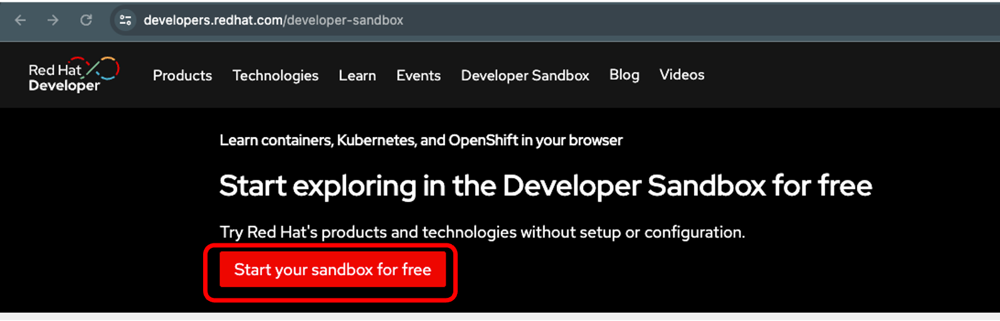
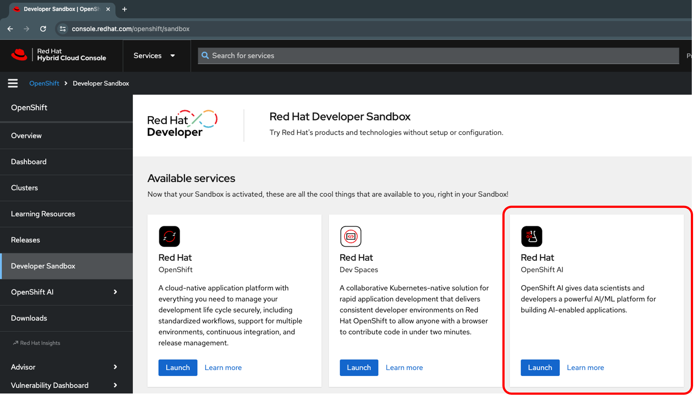
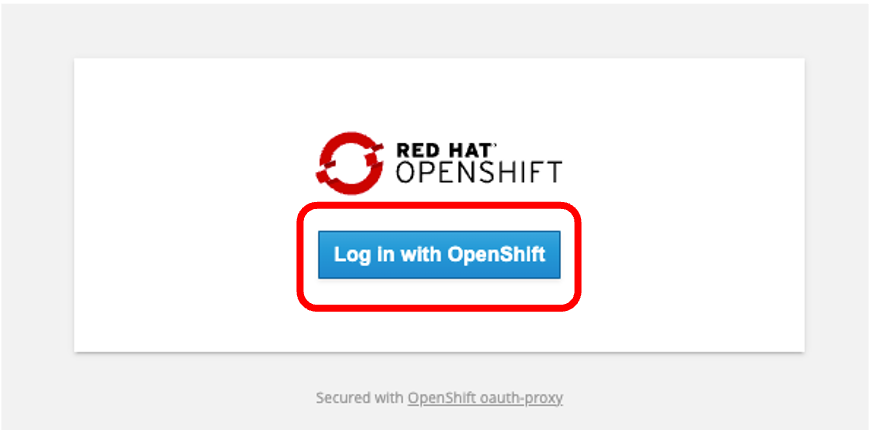
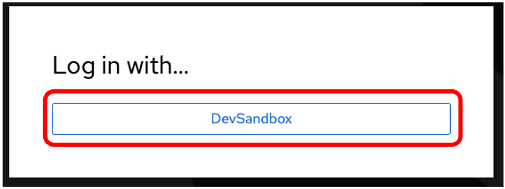
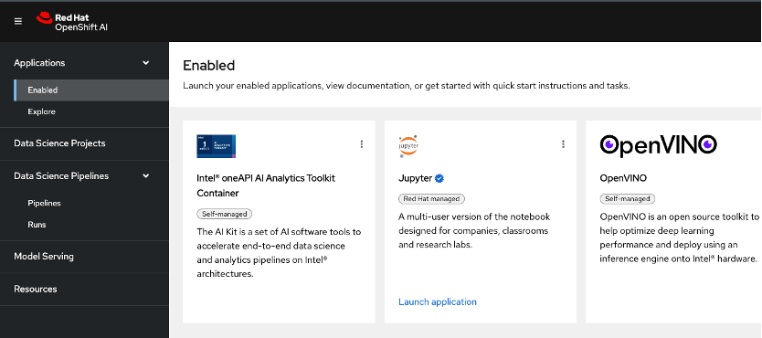

# OpenShift AI Sandbox

## OpenShift AI Sandboxの作成

{: .highlight }
Red Hat Developerのアカウントを持っていること。持っていない場合は、[Red Hat Developerのサイト](https://developers.redhat.com//)でアカウントを作成してください。

1. (https://developers.redhat.com/developer-sandbox) にアクセスして「Start your sandbox for free」ボタンをクリックします。未ログインの場合にはログイン画面が表示されるのでログインします。
{: .d-block .pl-1}
{: width="500"}
{: width="400"}

1. Sandboxの一覧から Red Hat OpenShift AI の「Launch」ボタンをクリックします。
{: .d-block}

1. OpenShift AIのログイン画面が表示されたら「Log in with OpenShift」ボタンをクリックし、次の画面で「Dev Sandbox」ボタンをクリックします。
{: .d-block}
{: width="400"}
{: width="400"}

1. OpenShift AI のポータル画面が表示されたら OK です。
{: .d-block}

