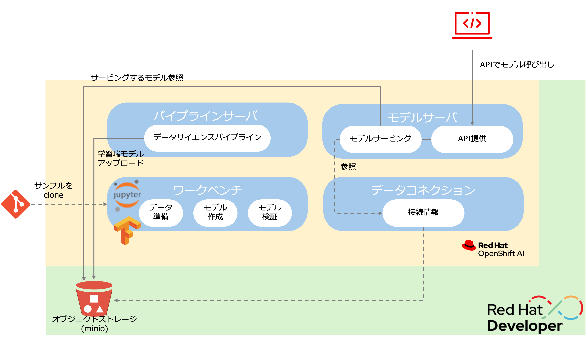

# 全体像

このワークショップでは、OpenShift AIのサンドボックスを利用してOpenShift AIの機能を使っていきます。

{: .d-block}

OpenShift AIを構成するコンポーネントは以下のとおりです。

* ワークベンチーJupyterNotebookなどを活用したモデルの開発環境
* データコネクションーモデルを保持するオブジェクトストレージへの接続情報
* パイプラインサーバーMLOpsのパイプラインを実行するサーバ
* Model Servingーモデルを公開するサーバ。APIで外部からアクセス可能。