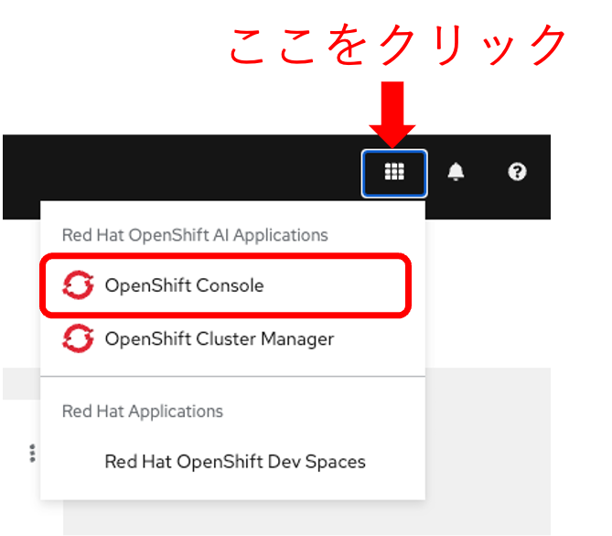
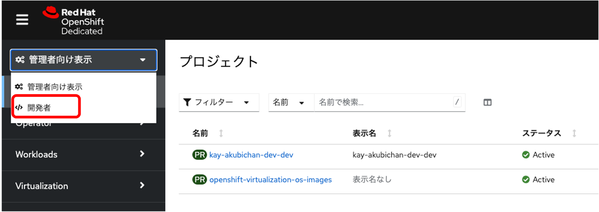
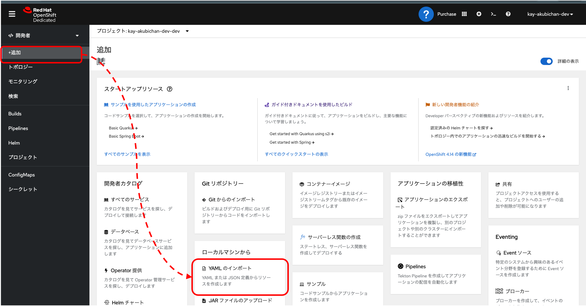
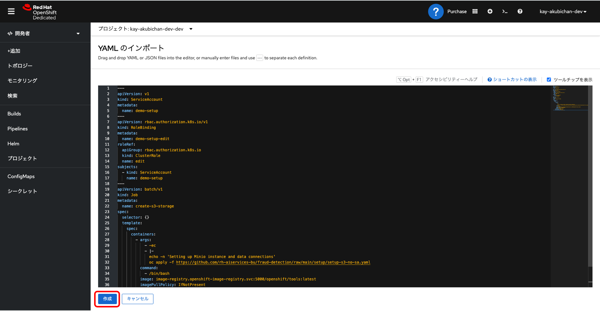
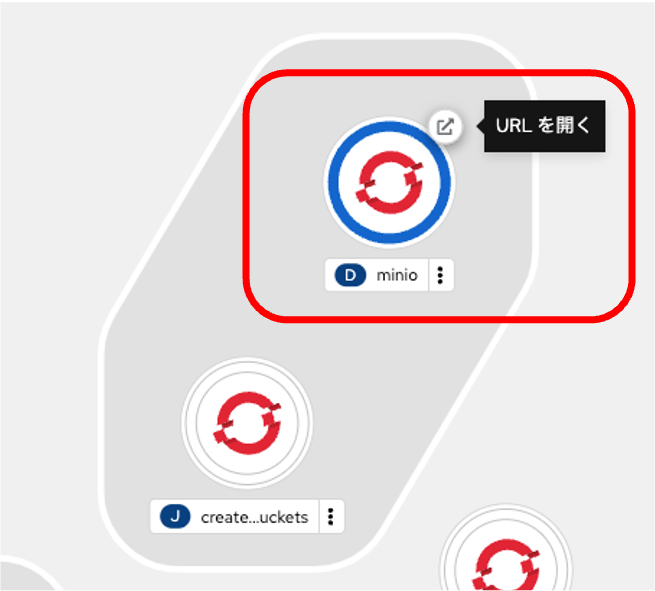
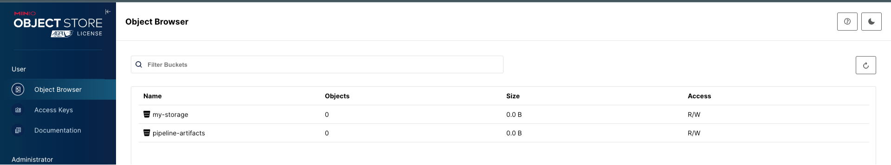

# Object Storageの準備


## OpenShift コンソールの起動

1. OpenShift AIダッシュボードの右上の■をクリックして、プルダウンメニューから「OpenShift Console」を選びます。
{: width="400" .d-block}

## Object Storageのデプロイ
{:style="counter-reset:none"}
1. OpenShiftコンソールの左上のプルダウンメニューで「開発者」を選んで開発者用のビューに変更します。
{: .d-block}

1. 左側のメニューで「＋追加」をクリックして表示されたトポロジー追加方法から「YAMLのインポート」を選択します。
{: .d-block}

1. 以下の内容をコピーペーストして「追加」ボタンをクリックします。
```
---
apiVersion: v1
kind: ServiceAccount
metadata:
  name: demo-setup
---
apiVersion: rbac.authorization.k8s.io/v1
kind: RoleBinding
metadata:
  name: demo-setup-edit
roleRef:
  apiGroup: rbac.authorization.k8s.io
  kind: ClusterRole
  name: edit
subjects:
  - kind: ServiceAccount
    name: demo-setup
---
apiVersion: batch/v1
kind: Job
metadata:
  name: create-s3-storage
spec:
  selector: {}
  template:
    spec:
      containers:
        - args:
            - -ec
            - |-
              echo -n 'Setting up Minio instance and data connections'
              oc apply -f https://github.com/rh-aiservices-bu/fraud-detection/raw/main/setup/setup-s3-no-sa.yaml
          command:
            - /bin/bash
          image: image-registry.openshift-image-registry.svc:5000/openshift/tools:latest
          imagePullPolicy: IfNotPresent
          name: create-s3-storage
      restartPolicy: Never
      serviceAccount: demo-setup
      serviceAccountName: demo-setup
```
{: .d-block}

1. minioのデプロイを確認
"Resources successfully created" というメッセージと以下のリソース名の一覧が表示されればOkです。
* demo-setup
* demo-setup-edit
* create s3-storage

{: .note }
このYAMLでは、AWS S3互換のオブジェクトストレージ[minio](https://min.io/)をデプロイするJOBを作成して実行します。
[`setup-s3-no-sa.yaml`](https://github.com/rh-aiservices-bu/fraud-detection/blob/main/setup/setup-s3-no-sa.yaml)は、minioをデプロイしこの後のワークショップで利用するためのBucketの作成を行います。
minioにアクセスするためのユーザとパスワードはランダムに作成されて、Endpointの情報などと一緒に`minio-root-user`というSecretに保存されます。
さらに、OpenShift AIのData Science projectのData Connectionに作成したBucketへの接続情報を登録します。

{:style="counter-reset:none"}
1. デプロイされたminioのURLを開くボタンをクリックしてminioのコンソールにアクセスします。
{: width="400" .d-block}

1. Bucketが2つ作成されていることを確認します。

**My Storage** 、**Pipiline** の2つのBucketが作成されています。
My Storageは作成したモデルの保存用、PipelineはData Science Pipelineのログなどの保存用です。
