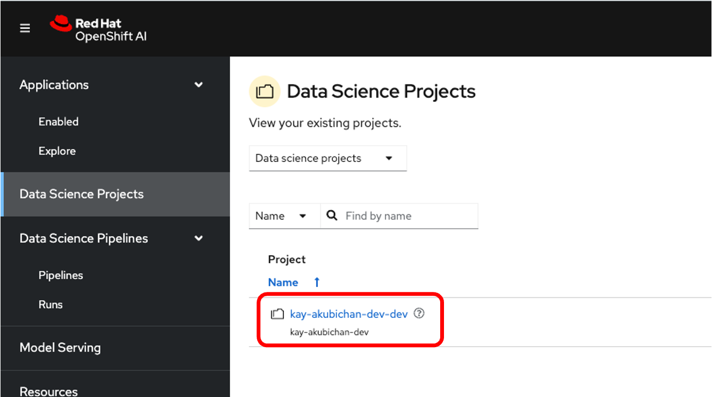
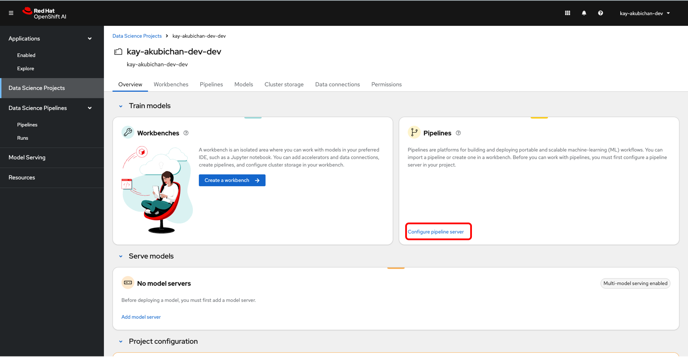
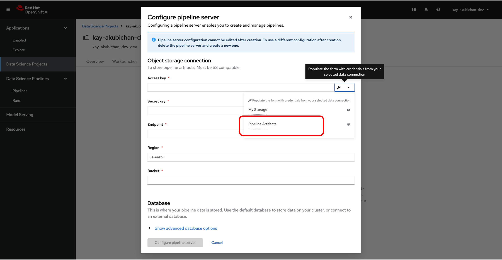
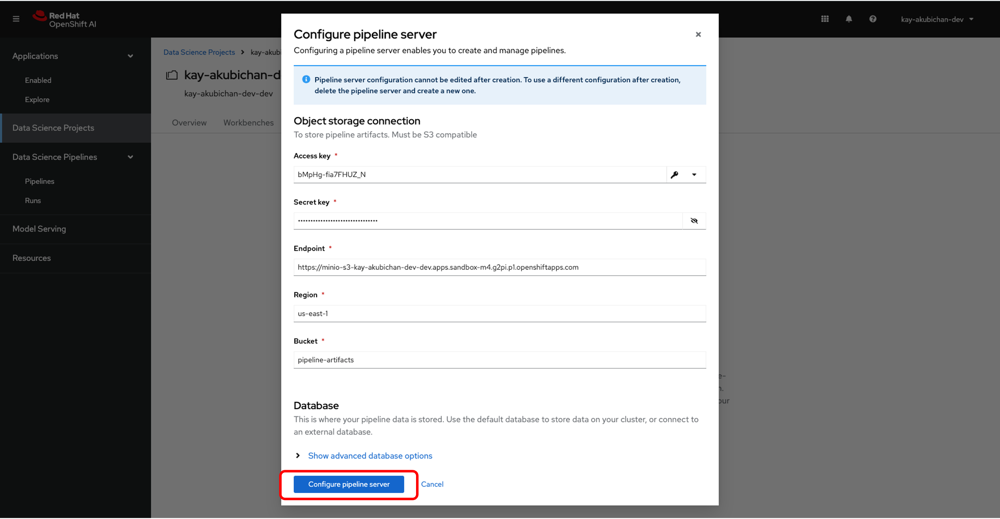
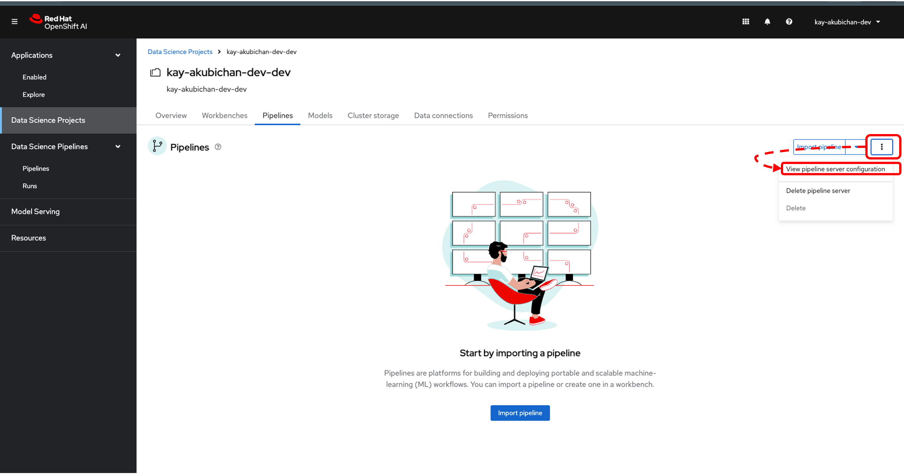
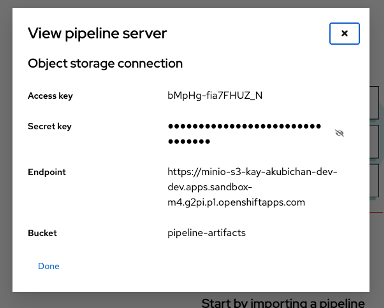

# Pipeline Serverの準備
データサイエンスパイプラインを実行するためのリソースを準備します。実際にパイプラインを実行するPodはパイプラインを実行する時に作成され、パイプラインが終了すると停止します。

Pipeline Serverを構成しデータサイエンスパイプラインのログなどを保存するためのオブジェクトストレージへの接続情報を設定します。

{:style="counter-reset:none"}
1. OpenShift AIのダッシュボードでData Science projectを選択します。
{: .d-block}

1. Data Science ProjectのPipeline領域で「Configure Pipeline Server」のリンクをクリックします。
{: .d-block}

1. Configure pipeline serverのダイアログの右上の鍵マークのプルダウンメニューから「Pipeline Artifacts」を選択します。
{: .d-block}

1. 設定内容を確認してダイアログ下部の「Configure pipeline server」ボタンをクリックします。
{: .d-block}

1. 右上の「:」をクリックし、プルダウンメニューから「View pipeline server configuration」を選択してサーバの設定ダイアログ表示し内容を確認します。
{: .d-block}

{: .d-block}
{: width="400"}