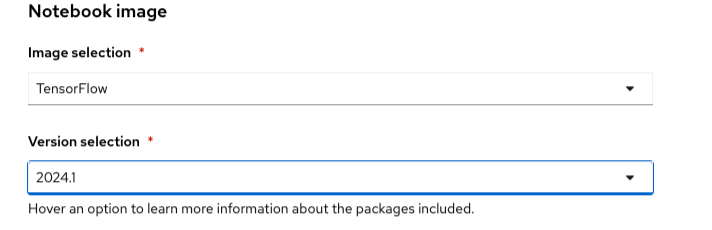

# ワークベンチ

ワークベンチは、モデルの開発と検証をする環境です。ワークベンチにはJupyterとモデル開発に必要なツールおよびライブラリで最適化されたデフォルトのノートブックイメージのコレクション、TensofFlowおよびPyTorchフレームワークが含まれます。

## ワークベンチの作成

1. Data Science Projectを選択します。

1. 「Workbench」タブを選択し、「Create workbench」ボタンをクリックしてワークベンチ作成画面を表示します。
{: .d-block}
{: width="500" .d-block}

1. ワークベンチの名前を入力します。
<dl>
  <dt>Name</dt><dd>Fraud Detection</dd>
  <dt>Description</dt><dd>空白のままでOK</dd>
</dl>
{: width="500" .d-block}

1. Notebook imageセクションで、イメージとバージョンを選択します。
<dl>
  <dt>Image selection</dt><dd>TensorFlow</dd>
  <dt>Version selection</dt><dd>2024.1 （※RecommendedとなっているバージョンでOK）</dd>
</dl>
{: width="500" .d-block}

{:style="counter-reset:none"}
1. デプロイサイズでSmallを選択します。
<dl>
  <dt>Container size</dt><dd>Small</dd>
  <dt>Accelerator</dt><dd>None</dd>
</dl>
{: width="500" .d-block}

{: .warning}
Sandbox環境はリソースが少ないので、Small以外だとワークベンチがデプロイできません。

{:style="counter-reset:none"}
1. 「Create new persistent Storage」を選択し、Persistent Storage Sizeを5GBに設定します。
{: width="500" .d-block}

{: .warning}
Sandbox環境はリソースが少ないので、ストレージサイズはデフォルトの20GBだとワークベンチがデプロイできません。

{:style="counter-reset:none"}
1. Data Connectionセクションで「Use existing data connection」を選択し、Data Connection のプルダウンメニューから「My Storage」を選択します。
{: width="500" .d-block}

1. 画面下部の「Create workbench」ボタンをクリックします。

1. ワークベンチのステータスがRunningになったら「Open」のリンクをクリックしてJupyter notebookを起動します。
{: .d-block}

{: note}
初回の起動時はコンテナイメージをダウンロードするので少し時間がかかります。

[Prev](./01_proj_pipelineserver.html){: .float-left}
[Next](./02_wb_2-jupyter.html){: .float-right}