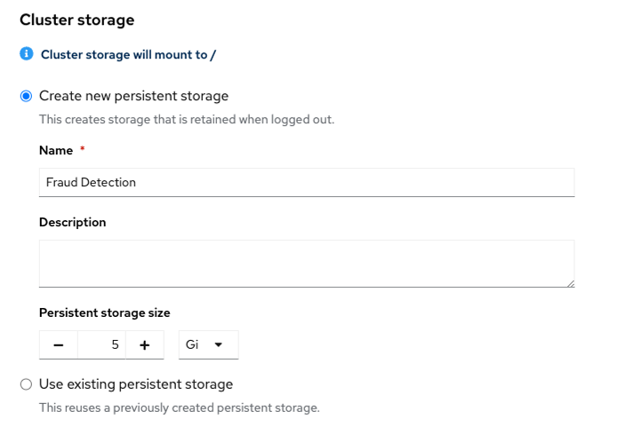

# ワークベンチ

ワークベンチは、モデルの開発と検証をする環境です。ワークベンチにはJupyterとモデル開発に必要なツールおよびライブラリで最適化されたデフォルトのノートブックイメージのコレクション、TensofFlowおよびPyTorchフレームワークが含まれます。

## ワークベンチの作成

{:style="counter-reset:none"}
1. Data Science Projectを選択します

1. 「Workbench」タブを選択し、「Create workbench」ボタンをクリックしてワークベンチ作成画面を表示します。
{: .d-block}

{: .d-block}
{: width="400"}

1. ワークベンチの名前を入力します。
{: .d-block}
{: width="400"}

1. Notebook imageセクションで、Image selectionで「Tensorflow」を選択し、Version selectionでRecommendedとなっているバージョンを選択します。
{: .d-block}
{: width="400"}

1. デプロイサイズでSmallを選択します。
{: .warning}Sandbox環境はリソースが少ないので、Small以外だとワークベンチがデプロイできません。
{: .d-block}
{: width="400"}

1. 「Create new persistent Storage」を選択し、Persistent Storage Sizeを5GBに設定します。
{: .warning}Sandbox環境はリソースが少ないので、ストレージサイズはデフォルトの20GBだとワークベンチがデプロイできません。
{: .d-block}
{: width="400"}

1. Data Connectionセクションで「Use existing data connection」を選択し、Data Connection のプルダウンメニューから「My Storage」を選択します。
{: .d-block}
{: width="400"}

1. 画面下部の「Create workbench」ボタンをクリックします。

1. ワークベンチのステータスがRunningになったら「Open」のリンクをクリックしてJupyter notebookを起動します。
{: .note}初回の起動時はコンテナイメージをダウンロードするので少し時間がかかります。
{: .d-block}
