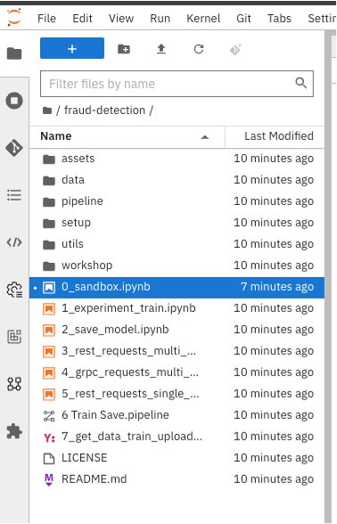

# Jupyter notebookの利用

1. Jupyter notebookにブラウザで開いていない場合は、ワークベンチを選択し「Open」のリンクをクリックします。
{: .d-block}

1. OpenShiftのログインダイアログが表示された場合は、「DevSandBox」ボタンをクリックしてログインします。
{: width="400" .d-block}

1. Notebookが開いたら、左上のGitのアイコンをクリックします。
{: .d-block}

1. サンプルのGitリポジトリのURLをコピペして「Clone」ボタンをクリックします。
```text
https://github.com/rh-aiservices-bu/fraud-detection.git
```
{: width="400" .d-block}

1. Cloneした fraud-detectionのディレクトリをクリックして、ソースコードの一覧を確認します。
{: width="400" .d-block}
{: width="400" .d-block}
