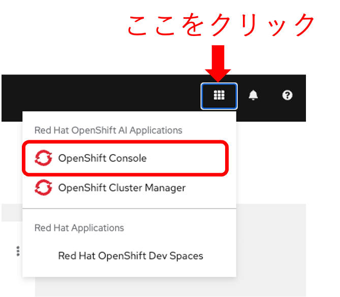
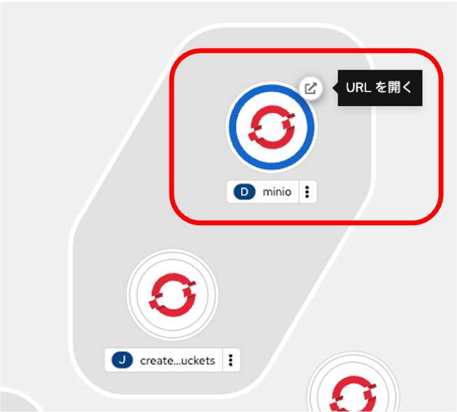

# サンプルのnotebookを利用してモデルのトレーニングと保存

## モデルのトレーニング

{:style="counter-reset:none"}
1. 左側のファイルのリストから `1_experiment_train.ipynb` を選択して内容を表示し、画面上部の「▶️」ボタンをクリックしてJupyter notebookを実行します。
{: .d-block}

## モデルの保存

{:style="counter-reset:none"}
1. Terminalを開いてモデルを保存するオブジェクトストレージへの接続情報が設定されているかを確認します。
{: .d-block}

1. Terminalで `env |grep AWS` コマンドを実行して環境変数を確認します。
{: .d-block}
以下の環境変数が設定されていることを確認します。
{: .note}
ワークベンチのData Connectionで設定したオブジェクトストレージへの接続情報が環境変数として設定されています。OpenShiftでのリソースは `aws-connection-mystorage`というシークレットです。
* AWS_ACCESS_KEY_ID
* AWS_SECRET_ACCESS_KEY
* AWS_S3_ENDPOINT
* AWS_DEFAULT_REGION
* AWS_S3_BUCKET

1. 左側のファイルのリストから `2_save_model.ipynb` を選択して内容を表示し、画面上部の「▶️」ボタンをクリックしてJupyter notebookを実行します。
{: .d-block}
実行中は右上の○が●になり、
{: width="400" .d-block}

## オプション: minioのポータル画面で保存されたモデルの確認
{:style="counter-reset:none"}
1. OpenShift AIの右上の■をクリックしてOpenShiftのコンソールを開きます。
{: width="400" .d-block}

1. トポロジー表示でminioのPodの右上のアイコンをクリックしてminioのポータルを開きます。
{: width="400" .d-block}

1. モデル保存の手順2で確認したAWS_ACCESS_KEY_IDとAWS_SECRET_ACCESS_KEYを使ってコンソールにログインします。
{: width="400" .d-block}

1. bucket一覧で「My Storage」を選択します
{: .d-block}

1. models → fraud → 1 の順番にフォルダをクリックしてモデルファイルを表示します。
{: .d-block}