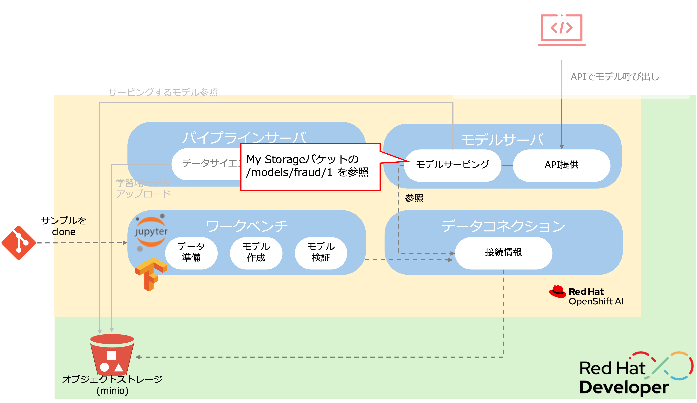
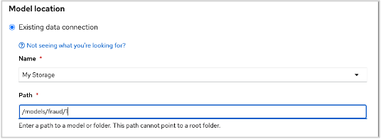

# マルチモデルサーバのデプロイ

モデルを公開するためのモデルサーバを準備し、そこにモデルをデプロイしてモデルをAPIで呼び出せるようにします。
ここでは外部からモデルサーバをAPIで利用できるようにするため、OpenShiftのRouteを作成します。

## ワークベンチの停止

Sandbox環境はリソースが少ないので、省エネのためにワークベンチを停止します。

1. ワークベンチの一覧でStatusのトグルボタンをクリックしてワークベンチを停止します。
{: .d-block}
{: width="400" .d-block}

## モデルサーバのデプロイ

1.「Models」タブを表示し「Add model server」ボタンをクリックします。
{: .d-block}

{: .note}
右上の緑の四角で囲んだところに「Multi-model serving enabled」と表示されているので、この環境ではMulti-modelサービングだけが利用可能です。

{:style="counter-reset:none"}
1. Add model serverダイアログでパラメータを入力して、画面下部の「Add」ボタンをクリックします。
* モデルサーバ名とランタイムの設定
<dl>
<dt>Model server name</dt><dd>Model Server</dd>
<dt>Serving runtime</dt><dd>OpenVINO Model Server</dd>
</dl>
{: .d-block}
* モデルサーバのレプリカ数を 1 に設定します。
{: .d-block}
* モデルサーバのサイズとアクセラレータの設定。
<dl>
<dt>Model server site</dt><dd>small</dd>
<dt>Accelerator</dt><dd>None (GPUを使わない)</dd>
</dl>
{: .d-block}
* 外部からアクセスするためのRouteを公開するかどうかの設定
<dl>
<dt>Make deployment models available throught an external route</dt><dd>チェックする</dd>
<dt>Reuire token authenticatino</dt><dd>チェックする</dd>
</dl>
{: .d-block}
* 全部入力が終わったら「Add」ボタンをクリック
{: .d-block}

## モデルのデプロイ

1. デプロイしたモデルサーバ名の行にある「Deploy model」ボタンをクリックします。
{: .d-block}

1. パラメータを入力したら、画面下部の「Deploy」ボタンをクリックします。
* モデル名を設定
<dl>
 <dt>Model name</dt><dd>fraud</dd>
</dl>
{: .d-block}
* モデルフレームワークを設定
<dl>
 <dt>Model framework</dt><dd>onnx - 1</dd>
</dl>
{: .d-block}
* モデルが保存されているオブジェクトストレージを設定
<dl>
 <dt>Name</dt><dd>My Storage</dd>
 <dt>Path</dt><dd>/models/fruad/1</dd>
</dl>
{: .d-block}
* 全部入力したら「Deploy」ボタンをクリック
{: .d-block}

{:style="counter-reset:none"}
1. モデルデプロイのステータスを確認
{: .d-block}