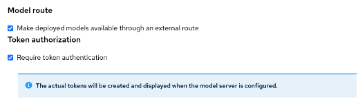

# マルチモデルサーバのデプロイ

## ワークベンチの停止

Sandbox環境はリソースが少ないので、省エネのためにワークベンチを停止します。

{:style="counter-reset:none"}
1. ワークベンチの一覧でStatusのトグルボタンをクリックしてワークベンチを停止します。
{: .d-block}

1.「Models」タブを表示し「Add model server」ボタンをクリックします。

{: .note }右上の緑の四角で囲んだところに「Multi-model serving enabled」と表示されているので、この環境ではMulti-modelサービングだけが利用可能です。

1. Add model serverダイアログでパラメータを入力して、画面下部の「Add」ボタンをクリックします。
{: .d-block}

{: .d-block}
Model server name:Model Server
Serving runtime:OpenVINO Model Server
{: .d-block}

{: .d-block}
Number of model server replicas to deploy: 1
{: .d-block}

{: .d-block}
Model server site: small
Accelerator: None
{: .d-block}

{: .d-block}
Make deployment models available throught an external route: チェックする
Reuire token authenticatino: チェックする
{: .d-block}

{: .d-block}
全部入力が終わったら「Add」ボタンをクリックします。

