# パイプラインの作成

## モデルサーバの停止
sandbox環境はリソースが少ないので、省エネのためモデルサーバのインスタンス数を0にします。

1. モデルサーバ一覧の右上の「：」をクリックして表示されるプルダウンメニューから「Edit model server」を選択します。 
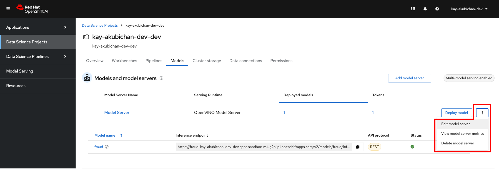

1. レプリカ数を0にして画面下部の「Update」ボタンをクリックします。

## ワークベンチの開始

1. Datascience Projectを選択します。

1. ワークベンチのステータスのトグルボタンをクリックしてワークベンチを開始します。
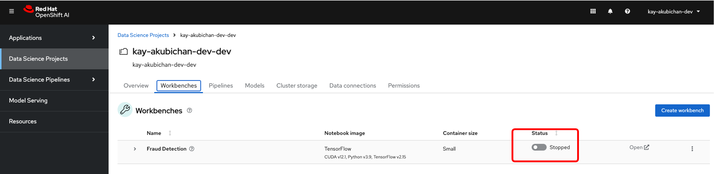

1. ワークベンチのステータスがRunningになったら「Open」のリンクをクリックしてノートブックを開きます。
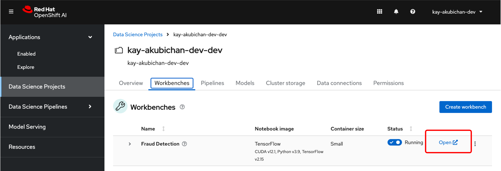

## パイプラインの作成

1. ノードブックの左側のメニューをクリックしてPipeline API Endpointを確認します
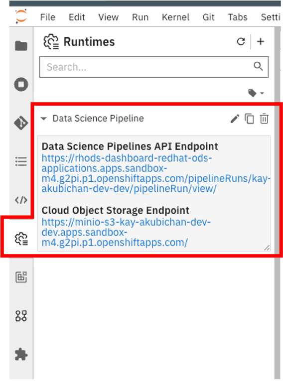

1. ノートブックのメニューでFile > New > Data Science Pipeline を選択して、データサイエンスパイプラインのエディタを開きます。
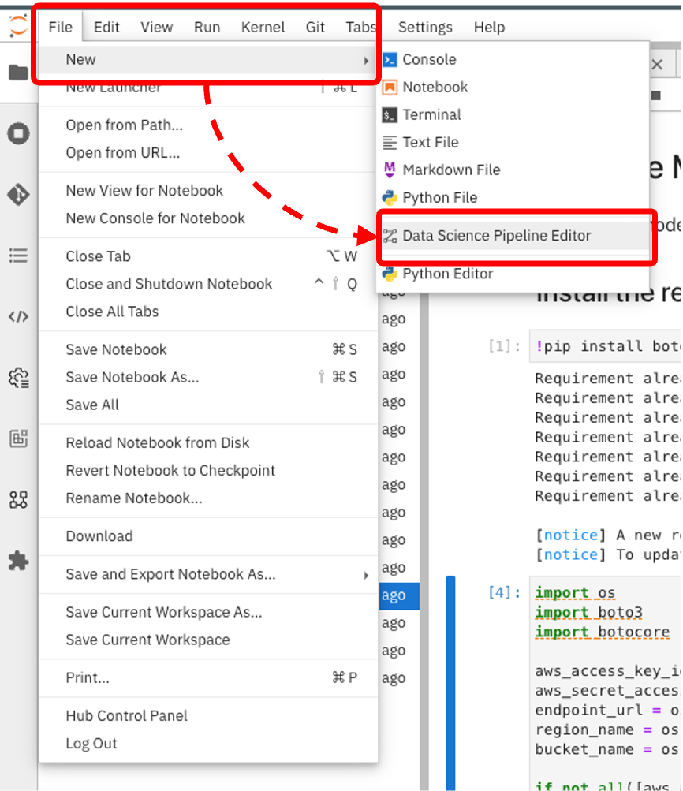

1. パイプラインエディタに `1_experiment_train.ipynb` と `2_save_model.ipynb` をDrap and Drop して、コネクタを接続します。
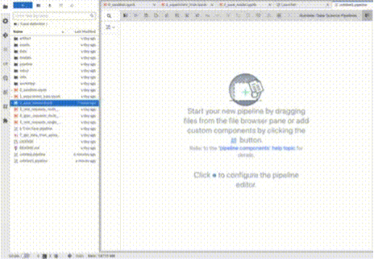

1. `1_experiment_train.ipynb` のノードのプロパティを編集します。

パイプライが実行されるコンテナが参照するプロパティを設定します。ここでは学習に利用するCSVファイルのパスと、学習の結果作成したモデルの出力パスを指定します。

* パイプラインエディタで `1_experiment_train.ipynb` のノードをクリックしてノードのプロパティ編集エリアを表示します。
* File Dependenciesに `data/card_transdata.csv` と入力します。
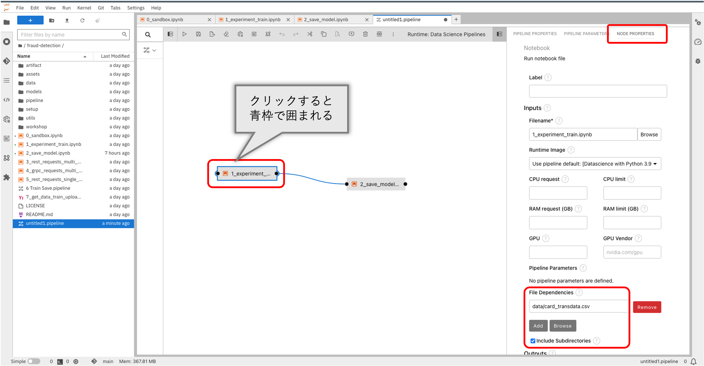

* 下にスクロールして、Outputs編集エリアを表示し「Add」ボタンをクリックします。
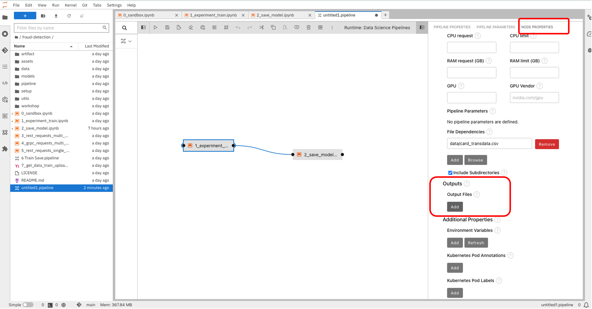

* テキストエリアに `model/fraud/1/fraud.onnx` と入力します。
![](../../assets/oai_notebook_pipeline_edit_node1_3.png

2. `2_save_model_ipynb` のノードプロパティを編集します。
パイプラインが実行されるコンテナが参照するプロパティを設定します。ここではモデルをオブジェクトストレージに保存する時のパスを設定します。

* パイプラインエディタで `2_save-model.ipynb` のノードをクリックしてノードのプロパティ編集エリアを表示します。
* Outputs編集エリアを表示し「Add」ボタンをクリックします。
* テキストエリアに `model/fraud/1/fraud.onnx` を入力します。
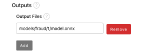

* Additional Propertiesに設定されている環境変数を削除します。削除する環境変数は、`AWS_ACCESS_KEY_ID`、`AWS_SECRET_ACCESS_KEY`、`AWS_S3_ENDPOINT`、`AWS_DEFAULT_REGION`、`AWS_S3_BUCKET` です。
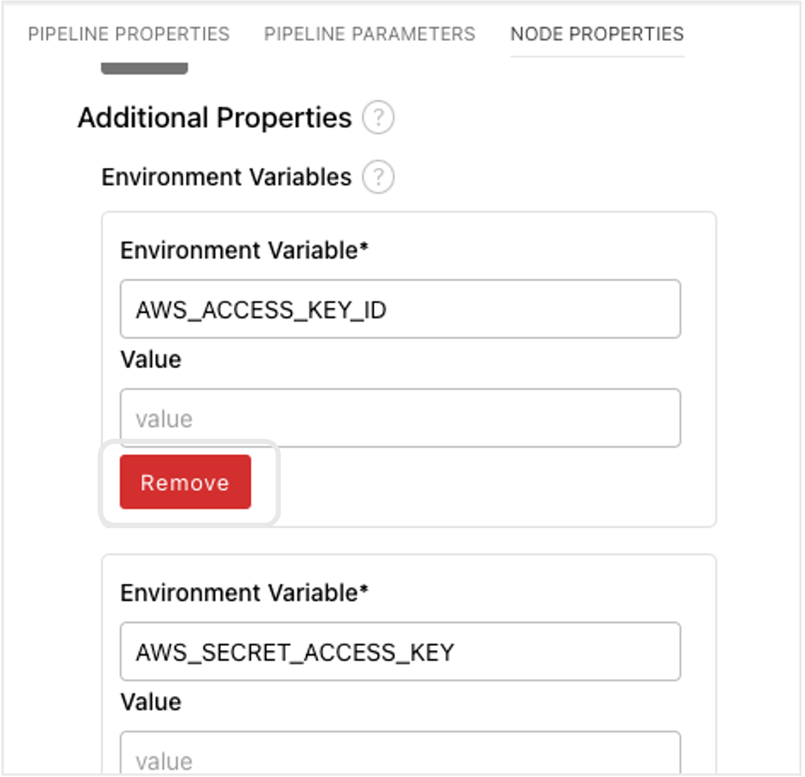

* Kubernetes Secrets編集エリアの「Add」ボタンをクリックしてkubernetesのSecretの値を参照できるようにします。

* 環境変数、シークレット、シークレットキーを設定します。

|Environment Variable|Secret Name|Secret Key|
|---|---|---|
|AWS_ACCESS_KEY_ID|aws-connection-my-storage|AWS_ACCESS_KEY_ID|
|AWS_SECRET_ACCESS_KEY|aws-connection-my-storage|AWS_SECRET_ACCESS_KEY|
|AWS_S3_ENDPOINT|aws-connection-my-storage|AWS_S3_ENDPOINT|
|AWS_DEFAULT_REGION|aws-connection-my-storage|AWS_DEFAULT_REGION|
|AWS_S3_BUCKET|aws-connection-my-storage|AWS_S3_BUCKET|

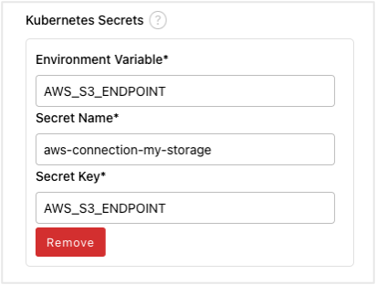

* 編集が終わったら、パイプライン編集画面上部の保存ボタンをクリックして保存します。
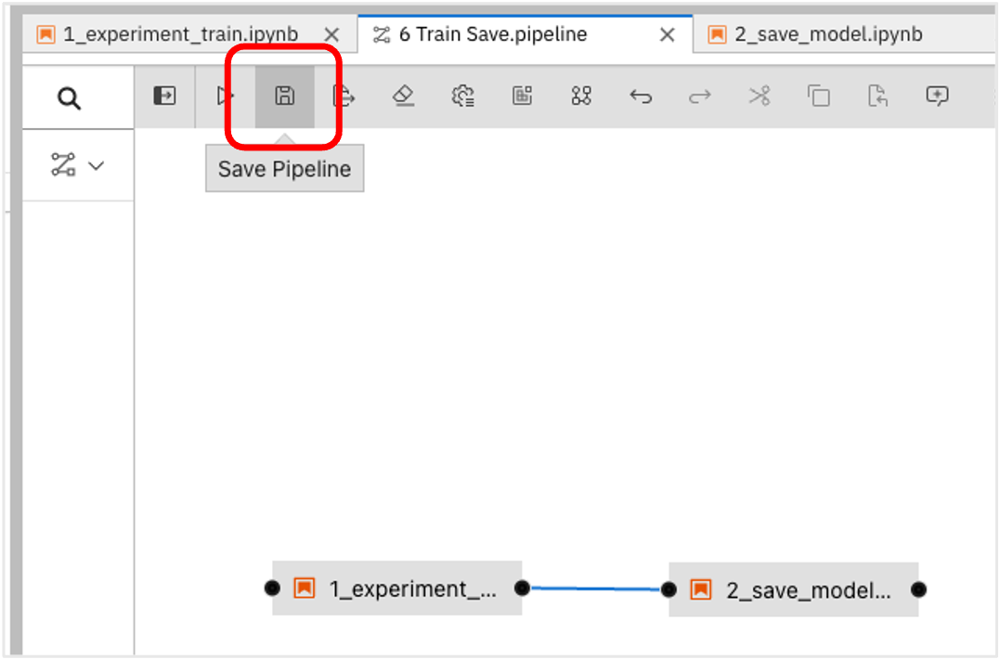

##　パイプラインの実行

1. パイプライン編集画面上部の「Run pipeline」ボタンをクリックしてパイプラインを実行します。
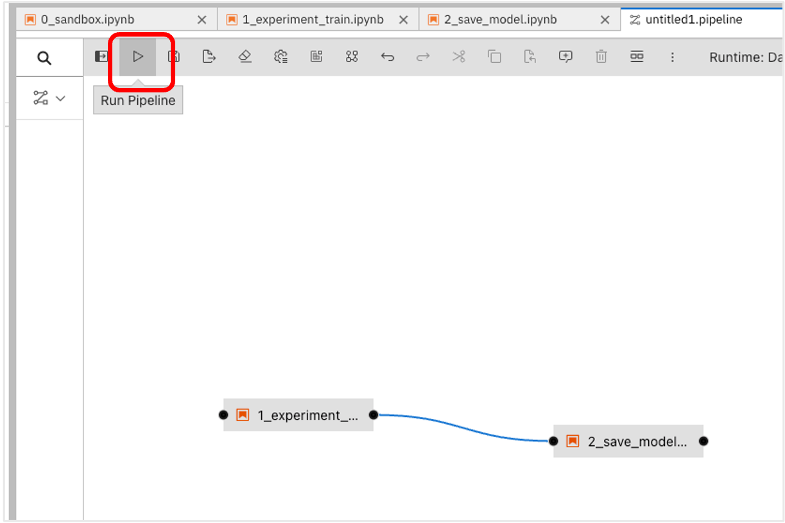

1. Run pipeline for Data Scienct Pipelineのダイアログが表示されたら、パイプライン名を入力して「OK」ボタンをクリックします.
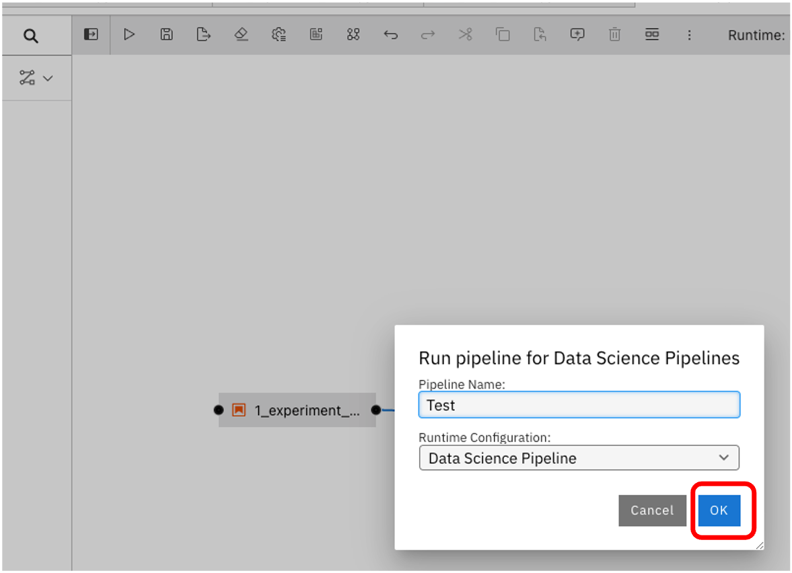

1. 少し待つとパイプライン開始のメッセージが表示されるので「OK」ボタンをクリックします。
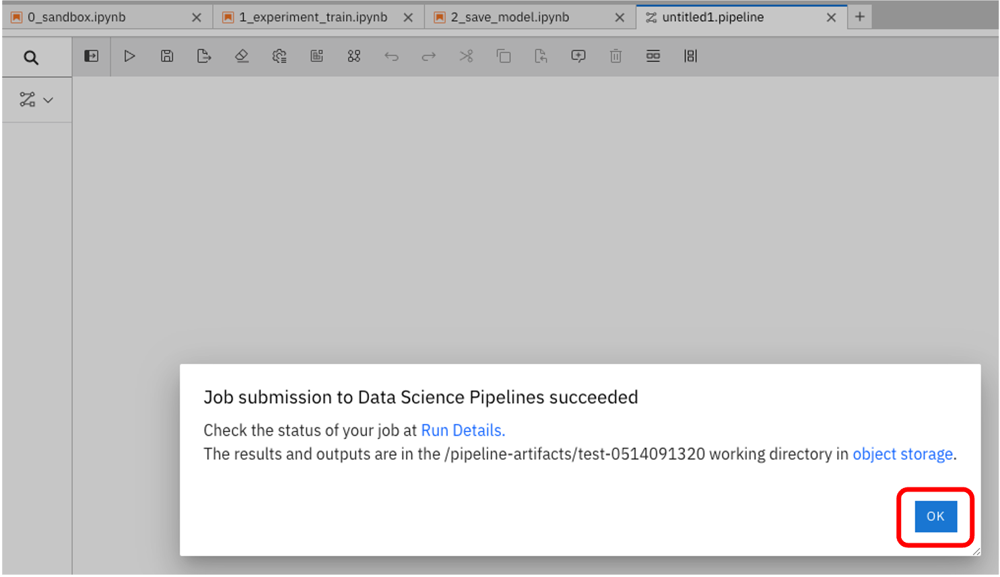

1. OpenShift AIのコンソールの左側のメニューで Data Science Pipeline > Runs をクリックして、パイプラインの実行状況を確認します。
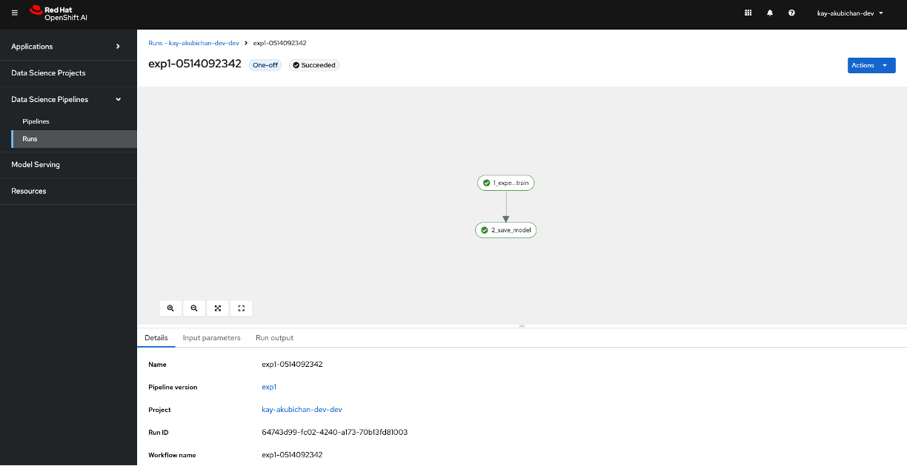

