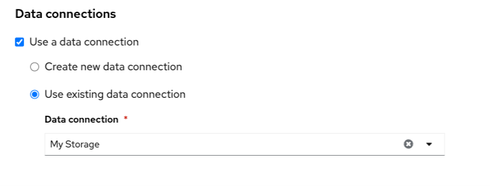

# ワークベンチ

{:style="counter-reset:none"}
1. Data Science Projectを選択します

1. 「Workbench」タブを選択し、「Create workbench」ボタンをクリックしてワークベンチ作成画面を表示します。

1. ワークベンチの名前を入力します。

1. ノートブックイメージとバージョンを選択します。

1. デプロイサイズを選択します。
{: .d-block}

1. 「Create new persistent Storage」を選択し、Persistent Storage Sizeを5GBに設定します。

1. Data Connectionセクションで「Use existing data connection」を選択肢、Data Connection のプルダウンメニューから「My Storage」を選択します。
