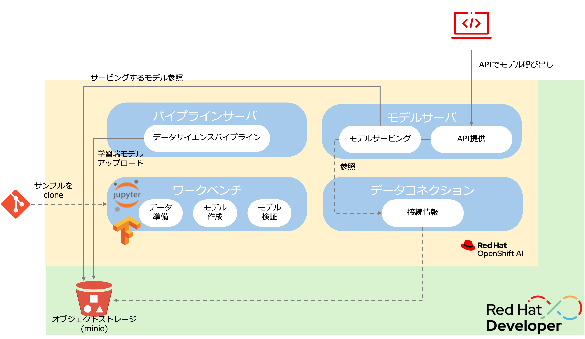

# 全体像

このワークショップでは、OpenShift AIのサンドボックスを利用してOpenShift AIの機能を使っていきます。

{: .d-block}

OpenShift AIを構成するコンポーネントは以下のとおりです。

* ワークベンチーJupyterNotebookなどを活用したモデルの開発環境
* データコネクションーモデルを保持するオブジェクトストレージへの接続情報
* パイプラインサーバーMLOpsのパイプラインを実行するサーバ
* Model Servingーモデルを公開するサーバ。APIで外部からアクセス可能。

## 参考になるサイトなど
* https://docs.redhat.com/ja/documentation/red_hat_openshift_ai_self-managed/2.9

[Prev](./index.md){: .float-left}
[Next](./00_intro_1-sandbox.md){: .float-right}